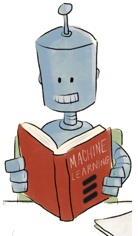

# EricML

Challenge repository with dataset and instructions: https://github.com/dwmh/signaling_heroes

## Models:

- Random Forest Classifier
- Extra Tree Classifier
- Ada Boost Classifie
- Bagging Classifier
- Voting Classifier (Ensemble of above estimators)

## Data

- Feature Selection (Remove features with lower variance) [feature_selection.nb]()
- Random Forest (features' importance) [signaling_heroes_dt.nb]()

## Visualization

- [PCA of test data (red elements are predictions)](pca_testdata.html)
- [PCA of train data (red elements are true labels)](pca_testdata.html)

